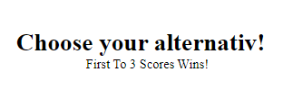

# Rock Paper and Scissors Game
   The Rock Paper and Scissors Game is Game made for the pure fun of playing one of the oldest hand games in the world, a real classic!                                 
  It's usually played agains another person but here you will play agains the random choices of the computer.   It's best of three points in the game.                                                     
  And its made for all people in all ages to get to enjoy the game.

## Features

### Header
 

 * On the top of the website you can find the header with the short text "lets go" and just under it says "Rock Paper And Scissors" for the website.
 - h1 and h2 text in the header so it's very visible text
 - you know what the website is about when you enter it.

 ## Game Area 

 

 ### Text in the game
 
 * telling the player to choose one of the alternativ down below.

 
 * When the choice is exactly the same as the computer's choice this appears.

 
  
  * Text (You Won!) Appears when you are winning.
  
  
  
  * Text (You Lose!) Appears when you lose.

  

  * If you win the text (congratulations you won!) text appears. Play again Button for restart the game also appears.
  - 3 points for player and it is a win.

  

  * If you lose the text (Sorry you lose!) appears. Play again Button for restart the game also appears.
  -  3 points for Computer and you lose.

  

  * This shows the alternative options of buttons for the game like Rock, Paper, Scissors.

  

  * Here is the score part. shows the player the amount of wins or loss they have.
  

## Footer 

* On the bottom of the website you can find the Footer with the text and link(Click to find Rules to the game!).

- The text is very clear and helping if there is any questions about the rules of the game.

- Hovering effect so you can see it's a link, the link is taking you to a website that has all the rules to the Rock Paper And Scissors game.

## Things left to implement to the website

* To change the pictures when computer or the player wins or lose. and switch out the buttons to hands instead. 

## Testing 

