# Rock Paper and Scissors Game
   The Rock Paper and Scissors Game is Game made for the pure fun of playing one of the oldest hand games in the world, a real classic!                                 
  It's usually played agains another person but here you will play agains the random choices of the computer.   It's best of three points in the game.                                                     
  And it's made for all people in all ages to get to enjoy the game.

* https://ui.dev/amiresponsive 

## Features

### Header
 

 * On the top of the website you can find the header with the short text "lets go" and just under it says "Rock Paper And Scissors" on the website.
 - h1 and h2 text in the header so it's very visible text
 - you understand what the website is about when you enter it.

 ## Game Area 

 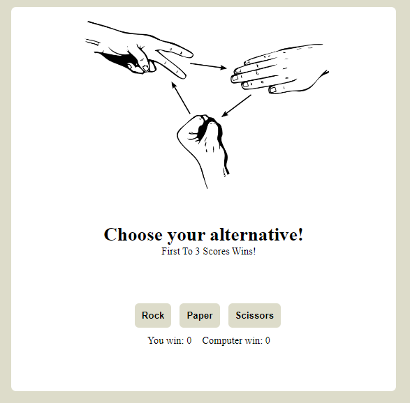

 ### Text in the game
 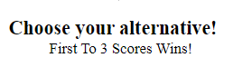
 * telling the player to choose one of the alternative down below.

 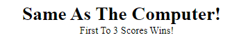
 * When the choice is exactly the same as the computer's choice this appears.

 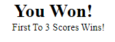
  
  * Text (You Won!) Appears when you are winning.
  
  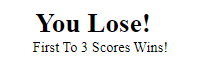
  
  * Text (You Lose!) Appears when you lose.

  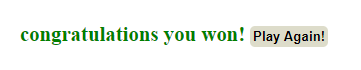

  * If you win the text (congratulations you won!) text appears. Play again Button for restart the game also appears.
  - 3 points for player and it is a win.

  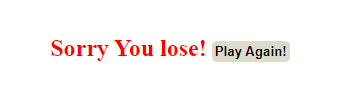

  * If you lose (Sorry you lose!) appears. Play again Button for restart the game also appears.
  -  3 points for Computer and you lose.

  

  * This shows the alternative options of buttons for the game Rock, Paper, Scissors.

  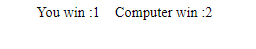

  * Here is the score part. shows the player the amount of wins or loss they have.
  

## Footer 

* On the bottom of the website you can find the Footer with the text and link(Click to find Rules to the game!).

- The text is very clear and helping if there is any questions about the rules of the game.

- Hovering effect so you can see it's a link, the link is taking you to a website that has all the rules to the Rock Paper And Scissors game.

## Things left to implement to the website

* To change the pictures when computer or the player wins or lose. and switch out the buttons to hands instead. 

## Testing 

* The website is work on the web browsers Google Chrome and Firefox And Safari without problems.

* Everything Works on the webpage all the buttons, scores and the links.

## Lighthouse testing 

 

 - accessibility in the Lighthouse testing was 100.
 

 ## HTML Validator
 ### tested in the official W3C Validator

 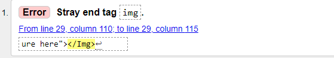

 * one error problem was found in the official W3C validator.

 ### Solving
 * deleted the last img line from the HTML code and the problem was solved.

 

 * No error was found in the official W3C Validator after the problem was solved.

 ## CSS Validator

 ### Tested with jigsaw validator

 
 
 * There was no problem found in the official jigsaw validator for the code.

 ## JSHint Validator
 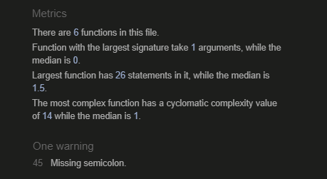

 * In the JSHint validator it shows that it was missing semicolons but no errors or warnings.

 ### solving 

 * Clean up the code and added the missing Semicolons.

## bugs

 There are no bugs to fix.

## Unfixed bugs

There is no unfixed bugs to fix.

## Deployment 

* The Deployment was made to github 

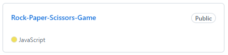

* In the repository. clicked on the project to get to the settings.

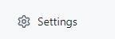

* In the repository on top of the page clicked settings.

* In the settings site to the left on the page is pages in a dropdown menu you will find it on the bottom of the choices.

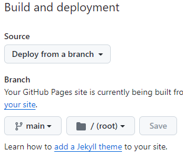

* there is box with the "Deploy from a branch". clicked on the alternative Main and then saved it.

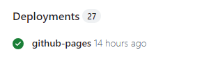

* In the repository after clicked on the project. there is on the right side on the webpage a title " Deployments" and under that is github-pages.

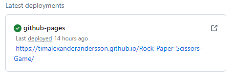 

*  The deplyment is complete and the link is now working.

## Credits 

### Content on the website

* https://www.webstacknotes.com/java-script/dom-practical-exmaples For help with structure and eventlisteners.

* https://www.w3schools.com/howto/howto_js_toggle_hide_show.asp For hiding elements.

*  https://www.freecodecamp.org/news/javascript-refresh-page-how-to-reload-a-page-in-js/ for restart the page.

### Media

* https://favicon.io/favicon-converter/ for the favicon.

* https://coolors.co/ for the color on the website. (#DDDCCA)

* Paint for the drawing.

* https://pixabay.com/vectors/fingers-fist-hands-paper-rock-149295/ for the picture on the website.

